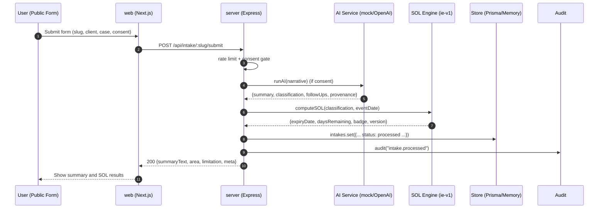

# Intake Submit Sequence

```mermaid
sequenceDiagram
  autonumber
  participant U as User (Public Form)
  participant W as web (Next.js)
  participant S as server (Express)
  participant AI as AI Service (mock/OpenAI)
  participant SOL as SOL Engine (ie-v1)
  participant DB as Store (Prisma/Memory)
  participant AUD as Audit

  U->>W: Submit form (slug, client, case, consent)
  W->>S: POST /api/intake/:slug/submit
  S->>S: rate limit + consent gate
  S->>AI: runAI(narrative) (if consent)
  AI-->>S: {summary, classification, followUps, provenance}
  S->>SOL: computeSOL(classification, eventDate)
  SOL-->>S: {expiryDate, daysRemaining, badge, version}
  S->>DB: intakes.set({... status: processed ...})
  S->>AUD: audit("intake.processed")
  S-->>W: 200 {summaryText, area, limitation, meta}
  W-->>U: Show summary and SOL results
```
