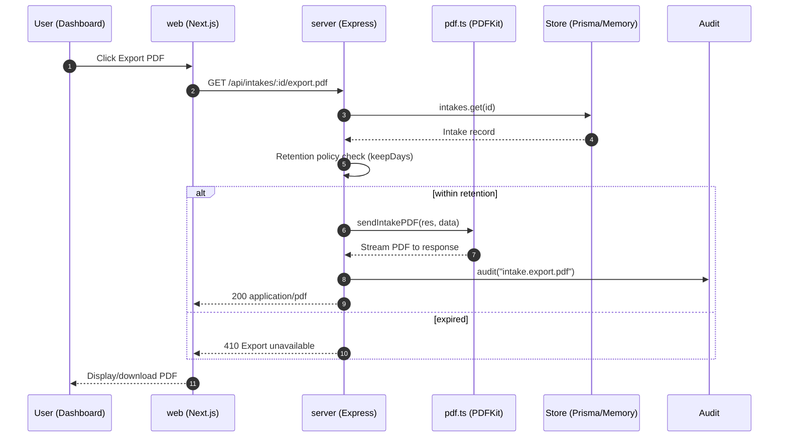

# PDF Export Sequence

```mermaid
sequenceDiagram
  autonumber
  participant U as User (Dashboard)
  participant W as web (Next.js)
  participant S as server (Express)
  participant PDF as pdf.ts (PDFKit)
  participant DB as Store (Prisma/Memory)
  participant AUD as Audit

  U->>W: Click Export PDF
  W->>S: GET /api/intakes/:id/export.pdf
  S->>DB: intakes.get(id)
  DB-->>S: Intake record
  S->>S: Retention policy check (keepDays)
  alt within retention
    S->>PDF: sendIntakePDF(res, data)
    PDF-->>S: Stream PDF to response
    S->>AUD: audit("intake.export.pdf")
    S-->>W: 200 application/pdf
  else expired
    S-->>W: 410 Export unavailable
  end
  W-->>U: Display/download PDF
```
